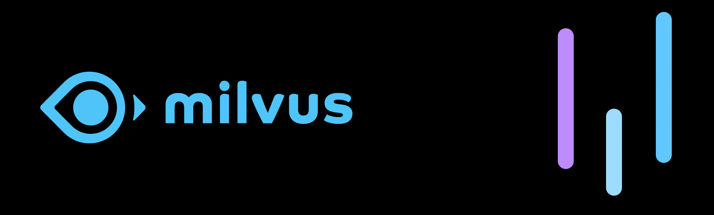

<p align="center"></p>

# Milvus.io PHP API Client

[](https://packagist.org/packages/helgesverre/milvus)
[](https://packagist.org/packages/helgesverre/milvus)
[](https://github.com/HelgeSverre/milvus/actions/workflows/main.yml)

[Milvus](https://github.com/milvus-io/milvus) is an open-source vector database that is highly flexible, reliable, and
blazing fast. It supports adding,
deleting, updating, and near real-time search of vectors on a trillion-byte scale.

This package is a PHP client for the stable Milvus REST v2 endpoints shared by Milvus 2.5 through 3.0. It is tested
against Milvus 2.5.21, 2.6.21, and 3.0.0, and built on [Saloon](https://docs.saloon.dev/).

See the [Milvus REST API documentation](https://milvus.io/api-reference/restful/v3.0.x/About.md) and the official
[collection](https://github.com/milvus-io/web-content/blob/master/scripts/apifox-docs/meta/openapi/05-collection-operations-v2.json)
and [vector](https://github.com/milvus-io/web-content/blob/master/scripts/apifox-docs/meta/openapi/04-vector-operations-v2.json)
OpenAPI definitions.

See the [changelog](CHANGELOG.md) for the complete v0.2.0 upgrade notes.

## Compatibility

The supported runtime matrix is PHP 8.3–8.5 and Laravel 12–13. Laravel 10 and 11 remain covered by compatibility
tests for existing applications, but both framework versions are end-of-life and should not be used for new
installations. Their CI jobs use Composer's command-scoped `--no-blocking` option because current Composer versions
block their affected upstream framework releases.

| Laravel Version | Tested PHP | Status |
|-----------------|------------|--------|
| 13.x            | 8.5        | Supported |
| 12.x            | 8.4        | Supported |
| 11.x            | 8.3        | Legacy compatibility |
| 10.x            | 8.3        | Legacy compatibility |

## Versions

| Milvus Version | PHP Client Version |
|----------------|--------------------|
| v3.0.x         | v0.2.x             |
| v2.6.x         | v0.2.x             |
| v2.5.x         | v0.2.x             |
| v2.3.x         | v0.0.x-v0.1.x      |

PHP 8.3–8.5 is supported. Laravel is optional; the client can also be used as a standalone Saloon connector.

## Installation

You can install the package via composer:

```bash
composer require helgesverre/milvus
```

You can publish the config file with:

```bash
php artisan vendor:publish --tag="milvus-config"
```

This is the contents of the published `config/milvus.php` file:

```php
return [
    'token' => env('MILVUS_TOKEN'),
    'username' => env('MILVUS_USERNAME'),
    'password' => env('MILVUS_PASSWORD'),
    'host' => env('MILVUS_HOST', 'localhost'),
    'port' => env('MILVUS_PORT', '19530'),
];
```

`MILVUS_TOKEN` takes precedence. When it is absent, the Laravel service provider builds the token from a complete
`MILVUS_USERNAME` and `MILVUS_PASSWORD` pair. Milvus expects that credential token in raw `username:password` format.

## Usage

### With Laravel

For Laravel users, you can use the `Milvus` facade to interact with the Milvus API:

```php
use HelgeSverre\Milvus\Facades\Milvus;

// NOTE: dbName is optional and defaults to 'default', this is only relevant if you have multiple databases.
// List all collections in the 'default' database
Milvus::collections()->list(
    dbName: 'default'
);

// Create a new collection named 'documents' in the 'default' database with a specified dimension
Milvus::collections()->create(
    collectionName: 'documents',
    dimension: 128,
    dbName: 'default',
    autoID: false,
);

// Describe the structure and properties of the 'documents' collection in the 'default' database
Milvus::collections()->describe(
    collectionName: 'documents',
    dbName: 'default',
);

// Drop or delete the 'documents' collection from the 'default' database
Milvus::collections()->drop(
    collectionName: 'documents',
    dbName: 'default',
);

// Insert a new vector into the 'documents' collection with additional fields like title and link
// Note "vector" is a reserved field name and must be used for the vector data
Milvus::vector()->insert(
    collectionName: 'documents',
    data: [
        [
            'id' => 123129471497,
            'vector' => [0.1, 0.2, 0.3 /* etc... */],
            'title' => 'Document name here',
            'link' => 'https://example.com/document-name-here',
        ],
    ]
);

// Search for similar vectors in the 'documents' collection using a provided vector
Milvus::vector()->search(
    collectionName: 'documents',
    data: [[0.1, 0.2, 0.3 /* etc... */]],
    annsField: 'vector',
);

// Delete a vector from the 'documents' collection using its ID
Milvus::vector()->delete(
    collectionName: 'documents',
    filter: 'id == 123129471497',
);

// Query the 'documents' collection for specific documents using a filter condition and select specific output fields
Milvus::vector()->query(
    collectionName: 'documents',
    filter: 'id in [443300716234671427, 443300716234671426]',
    outputFields: ['id', 'title', 'link'],
);

// Retrieve a specific vector from the 'documents' collection using its ID
Milvus::vector()->get(
    id: '123129471497',
    collectionName: 'documents'
);

// Update or insert a vector in the 'documents' collection. If the ID exists, it's updated; if not, a new entry is created
Milvus::vector()->upsert(
    collectionName: 'documents',
    data: [
        [
            'id' => 123129471497,
            'vector' => [0.1, 0.2, 0.3 /* etc... */],
            'title' => 'Document name here',
            'link' => 'https://example.com/document-name-here',
        ],
    ]
);

```

### Milvus 3 features

Milvus 3 can search using existing entity IDs instead of providing a vector directly:

```php
Milvus::vector()->search(
    collectionName: 'documents',
    data: null,
    annsField: 'vector',
    ids: [123129471497],
    outputFields: ['title', 'link'],
);
```

Partial upserts let you update scalar fields without resending the vector:

```php
Milvus::vector()->upsert(
    collectionName: 'documents',
    data: [
        ['id' => 123129471497, 'title' => 'Updated document name'],
    ],
    partialUpdate: true,
);
```

### Without Laravel

Without Laravel, create a `Milvus` instance with a token, host, and port. For username/password authentication, pass
the raw `username:password` value as the token.

```php
<?php
// use HelgeSverre\Milvus\Facades\Milvus;
use HelgeSverre\Milvus\Milvus;

$milvus = new Milvus(
    token: 'root:Milvus',
    host: 'localhost',
    port: '19530'
);


// Import the Milvus facade for easier access to Milvus functions

// NOTE: dbName is optional and defaults to 'default', this is only relevant if you have multiple databases.
// List all collections in the 'default' database
$milvus->collections()->list(
    dbName: 'default'
);

// Create a new collection named 'documents' in the 'default' database with a specified dimension
$milvus->collections()->create(
    collectionName: 'documents',
    dimension: 128,
    dbName: 'default',
);

// Describe the structure and properties of the 'documents' collection in the 'default' database
$milvus->collections()->describe(
    collectionName: 'documents',
    dbName: 'default',
);

// Drop or delete the 'documents' collection from the 'default' database
$milvus->collections()->drop(
    collectionName: 'documents',
    dbName: 'default',
);

// Insert a new vector into the 'documents' collection with additional fields like title and link
// Note "vector" is a reserved field name and must be used for the vector data
$milvus->vector()->insert(
    collectionName: 'documents',
    data: [
        [
            'id' => 123129471497,
            'vector' => [0.1, 0.2, 0.3 /* etc... */],
            'title' => 'Document name here',
            'link' => 'https://example.com/document-name-here',
        ],
    ]
);

// Search for similar vectors in the 'documents' collection using a provided vector
$milvus->vector()->search(
    collectionName: 'documents',
    data: [[0.1, 0.2, 0.3 /* etc... */]],
    annsField: 'vector',
);

// Delete a vector from the 'documents' collection using its ID
$milvus->vector()->delete(
    filter: 'id == 123129471497',
    collectionName: 'documents'
);

// Query the 'documents' collection for specific documents using a filter condition and select specific output fields
$milvus->vector()->query(
    collectionName: 'documents',
    filter: 'id in [443300716234671427, 443300716234671426]',
    outputFields: ['id', 'title', 'link'],
);

// Retrieve a specific vector from the 'documents' collection using its ID
$milvus->vector()->get(
    id: '123129471497',
    collectionName: 'documents'
);

// Update or insert a vector in the 'documents' collection. If the ID exists, it's updated; if not, a new entry is created
$milvus->vector()->upsert(
    collectionName: 'documents',
    data: [
        [
            'id' => 123129471497,
            'vector' => [0.1, 0.2, 0.3 /* etc... */],
            'title' => 'Document name here',
            'link' => 'https://example.com/document-name-here',
        ],
    ]
);

```

### Typed responses

Every request still returns a Saloon response, so existing `json()` and `collect()` calls continue to work. Call
`dto()` when you want a validated response object:

```php
$search = Milvus::vector()->search(
    collectionName: 'documents',
    data: [[0.1, 0.2, 0.3]],
    annsField: 'vector',
    limit: 3,
    outputFields: ['title'],
)->dto()->throwIfFailed();

foreach ($search->entities as $entity) {
    echo $entity->id.' '.$entity->field('title').PHP_EOL;
}
```

Milvus can report API failures with HTTP status 200, so use `throwIfFailed()` when handling a DTO. It throws a
`MilvusApiException` containing the Milvus error code. Malformed success payloads throw `InvalidResponseException`
instead of silently returning partial data.

The response types are `EmptyResponse` for create/drop, `CollectionListResponse`,
`CollectionDescriptionResponse`, `MutationResponse` for insert/upsert/delete, `EntityResponse` for get/query, and
`SearchResponse`. Dynamic entity fields and unknown future response fields remain available through `raw`.

### Using with Zilliz Cloud

If you are using the hosted version of Milvus, you will need to specify the following host and port along with your API
token:

```php
use HelgeSverre\Milvus\Milvus;

$milvus = new Milvus(
    token: 'db_randomstringhere:passwordhere',
    host: 'https://in03-somerandomstring.api.gcp-us-west1.zillizcloud.com',
    port: '443'
);
```

## Example: Semantic Search with Milvus and OpenAI Embeddings

This example demonstrates how to perform a semantic search in Milvus using embeddings generated from OpenAI.

### Prepare Your Data

First, create an array of data you wish to index. In this example, we'll use blog posts with titles, summaries, and
tags.

```php
$blogPosts = [
    [
        'title' => 'Exploring Laravel',
        'summary' => 'A deep dive into Laravel frameworks...',
        'tags' => ['PHP', 'Laravel', 'Web Development']
    ],
       [
        'title' => 'Exploring Laravel',
        'summary' => 'A deep dive into Laravel frameworks, exploring its features and benefits for modern web development.',
        'tags' => ['PHP', 'Laravel', 'Web Development']
    ],
    [
        'title' => 'Introduction to React',
        'summary' => 'Understanding the basics of React and how it revolutionizes frontend development.',
        'tags' => ['JavaScript', 'React', 'Frontend']
    ],
    [
        'title' => 'Getting Started with Vue.js',
        'summary' => 'A beginner’s guide to building interactive web interfaces with Vue.js.',
        'tags' => ['JavaScript', 'Vue.js', 'Frontend']
    ],
];
```

### Generate Embeddings

Use OpenAI's embeddings API to convert the summaries of your blog posts into vector embeddings.

```php
$summaries = array_column($blogPosts, 'summary');
$embeddingsResponse = OpenAI::client('sk-your-openai-api-key')
    ->embeddings()
    ->create([
        'model' => 'text-embedding-ada-002',
        'input' => $summaries,
    ]);

foreach ($embeddingsResponse->embeddings as $embedding) {
    $blogPosts[$embedding->index]['vector'] = $embedding->embedding;
}
```

### Create Milvus collection

Create a collection in Milvus to store your blog post embeddings, note that the dimension of the embeddings must match
the dimension of the embeddings generated by OpenAI (`1536` if you are using the `text-embedding-ada-002` model).

```php
$milvus = new Milvus(
    token: 'your-token',
    host: 'localhost',
    port: '19530'
);


$milvus->collections()->create(
    collectionName: 'blog_posts',
    dimension: 1536,
);
```

### Insert into Milvus

Insert these embeddings, along with other blog post data, into your Milvus collection.

```php
$insertResponse = $milvus->vector()->insert('blog_posts', $blogPosts);
```

### Creating a Search Vector with OpenAI

Generate a search vector for your query, akin to how you processed the blog posts.

```php
$searchVectorResponse = OpenAI::client('sk-your-openai-api-key')
    ->embeddings()
    ->create([
        'model' => 'text-embedding-ada-002',
        'input' => 'laravel framework',
    ]);

$searchEmbedding = $searchVectorResponse->embeddings[0]->embedding;
```

### Searching using the Embedding in Milvus

Use the Milvus client to perform a search with the generated embedding.

```php
$searchResponse = $milvus->vector()->search(
    collectionName: 'blog_posts',
    data: [$searchEmbedding],
    annsField: 'vector',
    limit: 3,
    outputFields: ['title', 'summary', 'tags']
)->dto()->throwIfFailed();

// Output the search results
foreach ($searchResponse->entities as $result) {
    echo "Title: " . $result->field('title') . "\n";
    echo "Summary: " . $result->field('summary') . "\n";
    echo "Tags: " . implode(', ', $result->field('tags', [])) . "\n\n";
}
```

## Running Milvus in Docker

To quickly get started with Milvus, you can run it in Docker, by using the following command

```bash
# Download the docker-compose.yml file
wget https://github.com/milvus-io/milvus/releases/download/v3.0.0/milvus-standalone-docker-compose.yml -O docker-compose.yml

# Start Milvus
docker compose up --wait --wait-timeout 180
```

A healthcheck endpoint will now be available on `http://localhost:9091/healthz`, and the Milvus API will be available
on `http://localhost:19530`.

To stop Milvus, run `docker compose down`. Data is stored in the local `volumes/` directory.

For more
details [Installing Milvus Standalone with Docker Compose](https://milvus.io/docs/install_standalone-docker.md)

For production workloads, consider checking out [Zilliz.com](https://zilliz.com/), which are the developers behind
Milvus and provides a hosted version of Milvus in the Cloud ☁️.

## Testing

The fast suite verifies request serialization, response decoding and edge cases, authentication, Laravel
service-provider resolution, and architecture rules without contacting Milvus:

```bash
composer test:unit
```

The integration suite requires Docker and performs a complete lifecycle against a real Milvus instance:

```bash
cp .env.example .env
docker compose up --wait --wait-timeout 180
composer test:integration
docker compose down --volumes
```

Run the remaining release checks with:

```bash
composer analyse src
composer format:test
composer validate --strict
composer audit
```

CI repeats the integration test against Milvus 2.5.21, 2.6.21, and 3.0.0, and runs the package suite across PHP
8.3–8.5 and Laravel 10–13.

## License

The MIT License (MIT). Please see [License File](LICENSE.md) for more information.

## Disclaimer

"Milvus®" and the Milvus logo are registered trademarks of
the [Linux Foundation](https://www.linuxfoundation.org/about) (LF Projects, LLC). This package is not affiliated with,
endorsed by, or sponsored by the Linux Foundation. It's developed independently and uses the "Milvus" name under fair
use, solely for identification. All trademarks and registered trademarks, including "Milvus®", are the property of their
respective owners. "Milvus®" is
a [registered trademark](https://branddb.wipo.int/en/quicksearch/brand/EM500000018660437) of the Linux Foundation.
